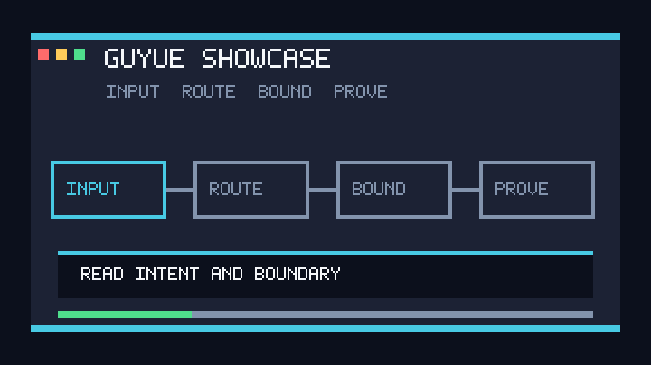

# guyue (古月)

> 一句话钩子：把你反复向 AI 解释的工作方式，沉淀成可安装、可验证、可复用的 Agent 操作层。

古月是从真实 AI 协作记录中蒸馏出来的个人工作方式系统，它以古月式判断和执行纪律为主干，按需调用技能、工具、记忆和工作流，帮助 Agent 更稳定地完成复杂工作。

[](https://skills.sh/guyue55/guyue-skill)


> [!IMPORTANT]
> 古月不是“完整的人”，也不是万能自动化系统。它是一个 Personal Agent Operating Layer：用古月式判断、执行纪律、审美偏好、风险边界和复盘方式，调度不同技能与工具完成工作。



## 为什么你需要它？

当你让 AI 帮你干活时，你是否遇到过以下痛点：
1. **幻觉与过时**：AI 直接用它训练集里废弃了三年的旧版本 API 糊弄你。
2. **不管三七二十一直接梭哈**：抛出一个含糊的需求，AI 直接帮你生成了 500 行没有任何拆分、强耦合的垃圾代码。
3. **遇到报错只会盲目试错**：跑不过测试就盲目改代码，最后连原本好的部分也改坏了。

`guyue` 不是一个简单的“提示词”或“单点防爆插件”，它是您的**全能型数字合伙人 (Digital Twin)**。它将古月本人的严苛思考方式与底层 SOP 注入到了 AI 的血液中。它不仅教 AI 写代码，更教 AI **克制**写代码。

## 快速开始

**本地源码挂载（适合 Codex/Claude Code/OpenClaw 等 Skill-compatible runtime）：**

```bash
git clone https://github.com/guyue55/guyue-skill.git
cd guyue-skill
bash scripts/test_suite.sh
```

安装到你的 Agent 技能目录后，直接用自然语言触发：

```text
使用古月的思路帮我分析这个需求，先别写代码。
线上报错了，启动古月的排障心法。
把这次成功排障沉淀成 SOP，并记住关键教训。
```

更完整的运行时安装路径见 [docs/installation.md](docs/installation.md)。安全边界见 [docs/security.md](docs/security.md)。评测方式见 [docs/evaluation.md](docs/evaluation.md)。

想先看真实输出，可直接阅读 [examples/quickstart-output.md](examples/quickstart-output.md)。它记录了 2026-07-01 的 Codex read-only 活体回放，包括通过项、偏差和下一步修复边界。

## 核心心智矩阵：1 个核心分身 + 12 个专精能力

本系统采用类似操作系统的多智能体路由架构（Digital Twin Orchestrator），主干会自动拦截你的意图，并派发给古月分身下最专业的子能力（当前精通开发流，未来持续进化）：

- 🚦 **核心分身 (guyue)**：接管意图，强制注入模块化解耦、全局规划、规范化纪律的底层思维 SOP。
- 🔍 **前置调研 (research-and-sourcing)**：收到新需求时，**强制停手**，必须先去联网获取最新官方文档或对标高星开源项目。
- 🤔 **需求反问 (requirement-analysis)**：采用 WISER 框架，拒绝单向接受需求，强制通过链式反问挖掘边界和异常流。
- 🎯 **价值拷问 (product-sense)**：在进入系统设计前，强制剥离技术滤镜，审视需求的 ROI 和商业逻辑。
- 🏛️ **系统设计 (system-design)**：采用 DEPTH 框架，强制执行 Human-in-the-Loop 审批，不看到高维度架构方案前，拒绝写一行代码。
- 💻 **开发纪律 (coding-discipline)**：进入编码阶段时，强制执行高内聚低耦合的架构规范，并默认应用前端/UI最佳实践。
- 🕵️ **受控排障 (debugging-mindset)**：引入 RCA 诊断矩阵，没看到原始日志/报错堆栈前，绝对拒绝通过盲猜来改代码。
- 📝 **结构化沉淀 (documentation)**：采用 RTFD 框架与 XML 隔离，写出极简、结构化、金字塔逻辑的 README 或架构决策记录。
- ✨ **前端与交互美学 (frontend-expert)**：强制推行 Vanilla CSS/JS 极简主义、a11y 约束，并默认融入 GSAP 级三幕剧动效与商业语境转换。
- 🏭 **标准件车间 (sop-maker)**：当一项复杂排障或开发流成功闭环后，将其提炼、泛化并打包为可复用的操作手册 (SOP)。
- 🧠 **双轨记忆 (memory-bank)**：负责提取、归档并回溯之前的错误与成功经验，确立“不在同一个坑里摔倒两次”的准则。
- 🛠️ **技能制作 (skill-crafting)**：从真实会话矿脉中提炼能力，再交给女娲蒸馏、鲁班打磨、活体验证。
- 🧭 **生态寻猎 (ecosystem-scout)**：调研外部技能/工具，按 Two-Phase Loading 轻量注册，避免把全量 README 和源码塞进上下文。

## 大盘心法与规范矩阵 (Master Principles & Uniform Matrix)

经历多轮鲁班法则深度打磨后，所有子技能目前遵循 100% 统一的工业级结构：

1. **三大核心纪律 (`GUYUE_PRINCIPLES.md`)**:
   - **Trace-First**: 强制在每一次技能拦截前输出 `[Trace: Guyue/xxx]`，打破 AI 黑盒。
   - **Anti-Bloat 与林迪效应**: 拒绝为了技术而引入重型框架，崇尚零依赖与极简，追求架构的未来十年生存期。
   - **Human-in-the-Loop**: 守住高风险架构与合规边界，必要时果断刹车。

2. **矩阵级结构大一统**: 12 个核心技能全面实施相同的指令骨架。
   - **When to Use**: 明确何时该由什么子分身接管。
   - **Anti-Patterns to Avoid**: 定义绝对不要做的行为。
   - **Step-by-Step Execution**: 标准化作业流程。
   - **Showcase (展台)**: 高密度的应用范例场景。
   - **Guardrails (诚实边界)**: 明确不能越权的死线。
   - **Cross-Skill Invocation**: 技能流转协议，使得 11 个专精能力可以组合形成智能闭环。

## MCP 接入

如果你使用 Cursor、Claude Desktop 等支持 MCP 协议的工具，可以直接将古月作为原生插件挂载，让大模型直接拥有读写古月记忆库和调用古月生态的能力。

在你的 MCP 配置文件中添加：
```json
{
  "mcpServers": {
    "guyue": {
      "command": "uv",
      "args": [
        "run",
        "--with",
        "mcp",
        "mcp_server.py"
      ],
      "cwd": "/path/to/guyue/src"
    }
  }
}
```
*注意：替换 `cwd` 为你实际克隆的目录路径。*

**传统挂载方式**（如 Claude Code, OpenClaw）：

```bash
npx skills add guyue55/guyue-skill
```

**依赖的前端与交互基建技能（必装）**：

由于古月 `frontend-expert` 极其看重商业级 UI 与交互，强烈建议补齐以下外部专业技能。如果缺失，`scripts/doctor.py` 探针也会在运行时报警并提供一键安装指令：

```bash
# 极致的前端与交互美学设计规范
npx skills add nextlevelbuilder/ui-ux-pro-max-skill

# 前端动画与交互核心库 (GSAP)
npx skills add greensock/gsap-skills
```
**源码直装方式**（用于本地开发或深度定制）：

```bash
# 1. 进入你的 agent 技能目录
cd ~/.gemini/config/skills/  # (以你的实际 Agent 技能路径为准)

# 2. 克隆本套件
git clone https://github.com/guyue55/guyue-skill.git

# 3. 技能将自动生效，全局守护你的每一次代码生成！
```

## 触发方式

在与 AI 的对话中，你可以随时唤醒“古月分身”：

- "使用古月的思路帮我分析一下这个需求..."
- "我们要加个支付模块，像古月那样出个严谨的设计。"
- "线上报错了 502，启动古月的排障心法。"
- "帮我用古月的标准梳理一份业务 SOP。"
- "调研一下最新的 Next.js 权限控制，开启古月的调研流。"

## 它会交付什么？

- **工业级防爆架构**：基于 DEPTH 模型和 RCA 矩阵的防御性编程。
- **可见的工作流产物**：需求边界、调研结论、设计方案、RCA 矩阵、SOP、文档、提交建议，而不是只输出一段泛泛回答。
- **双轨长时记忆引擎 (Structured Memory Bank)**：拥有主动复盘能力。本地挂载 `.guyue_memory`，通过 JSON 元数据索引 + Markdown 详情实现 $O(1)$ 级教训检索，不在同一个坑里跌倒两次。
- **开放生态协议 (MCP Ready)**：动态注册表 `skills_manifest.json` 与外挂记忆引擎在设计上原生兼容 [Model Context Protocol (MCP)](https://modelcontextprotocol.io/)，可作为独立编排器介入现有工作流。
- **硬核健康探针 (Doctor Probe)**：内置 `scripts/doctor.py` 探针，调度外部前沿技能（如 `LearnPrompt/luban-skill`、`alchaincyf/nuwa-skill`）前强制检测环境健康度，提供零摩擦降级提示。
- **高转化前端美学 (UI/UX Real-world Proving Ground)**：附带 `examples/saas-conversion-demo/` 实战 Demo，示范如何将枯燥的 500 报错翻译为“商业代价预估”，并运用 Vanilla JS + GSAP ScrollTrigger 实现三幕剧丝滑动画。
- **极简即插即用**：零硬编码绑定，SOP 工具包一键全环境泛化。

## 安全边界

- **不执行危险代码**：在 `system-design` 阶段，在您确认方案前，绝对不执行写入操作。
- **事实隔离**：在 `research-and-sourcing` 阶段，调研回来的资料会强制放入 `<context>` 中，与执行指令硬隔离，防范幻觉污染。
- **外部技能不直接吞入**：未知工具、GitHub 项目和第三方 Skill 先由 `ecosystem-scout` 生成评估报告，得到明确授权后才写入轻量依赖记录。
- **提交前必须验收**：公开发布或提交前至少运行 `bash scripts/test_suite.sh`，同时保留安全扫描、依赖探针、格式校验和测试 prompt 体检结果。

## 文件结构

```text
guyue/
├── SKILL.md                 # 核心路由中枢
├── README.md                # 本文件
├── GUYUE_PRINCIPLES.md      # 古月大盘心法原则
├── skills.json              # 技能注册表
├── skills_manifest.json     # 动态包清单与路由分发引擎
├── docs/                    # 安装、安全、评测、发布边界
├── scripts/                 # 核心脚本库
│   ├── doctor.py            # 环境依赖硬核健康探针
│   ├── run_eval.py          # 测试 prompt 结构体检
│   └── ci_validate_skills.py# CI 检测流水线
├── examples/                # 实战对比展示案例
│   ├── quickstart-output.md # Codex read-only 活体回放证据
│   └── saas-conversion-demo/# 🎯 交互式高转化 UI/UX Demo (GSAP + Tailwind 最佳实践)
├── test-prompts.json        # 预设的干跑测试用例
├── references/              #
│   └── research/            # 萃取的训练语料沉淀
└── skills/                  # 垂直专精子技能矩阵
    ├── coding-discipline/
    ├── debugging-mindset/
    ├── documentation/
    ├── ecosystem-scout/
    ├── frontend-expert/
    ├── memory-bank/
    ├── product-sense/
    ├── requirement-analysis/
    ├── research-and-sourcing/
    ├── skill-crafting/
    ├── sop-maker/
    └── system-design/
```

## 出师证书

```text
┌───────────────────────────────────────────────┐
│  出师证书 · 鲁班工坊                            │
│                                               │
│  作品：guyue (古月数字分身 v1.1.0)              │
│  打磨前：只有基础的工程防线与生硬的界面           │
│  打磨后：可安装、可验证、可传播的 Agent 操作层    │
│  定位：Personal Agent Operating Layer            │
│  绝活：真实协作语料蒸馏 + 技能路由 + 验证纪律     │
│                                               │
│  验收师傅：鲁班                                 │
└───────────────────────────────────────────────┘
```
