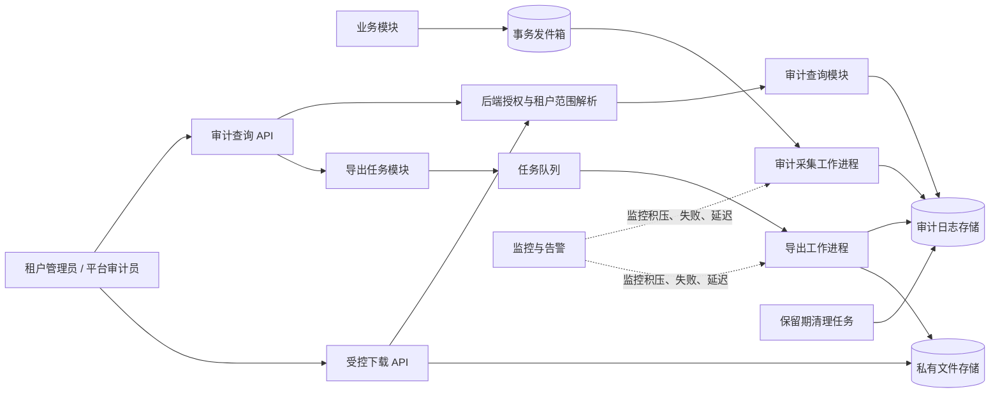
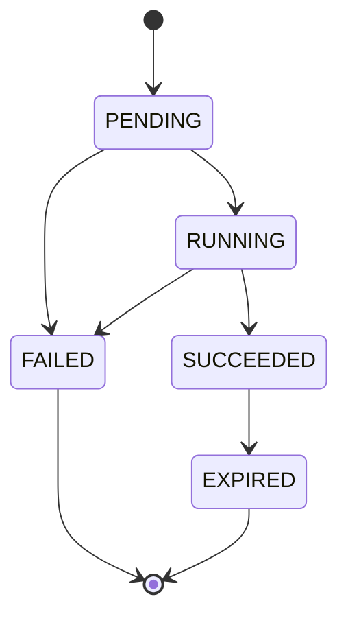
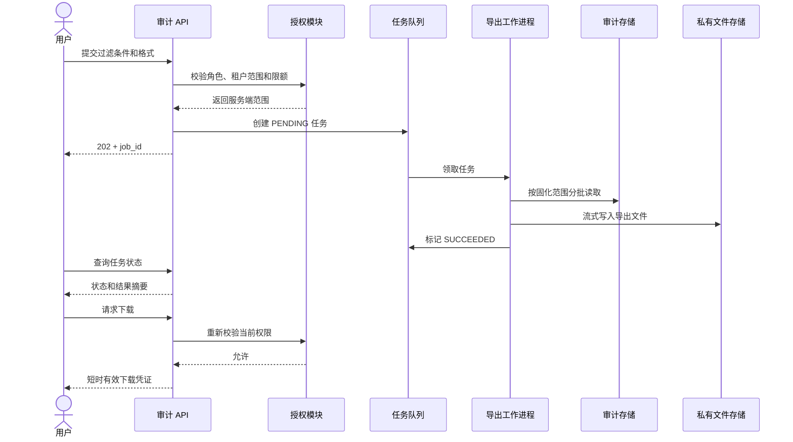

# 多租户 SaaS 只读审计日志系统设计

## 1. 业务目标与边界

为安全调查、合规核查和客户自助排障提供最近 180 天的操作证据。

已确认约束：

- 审计日志对用户只读，不提供修改或手动删除接口。
- 租户管理员只能查看、导出本租户数据。
- 平台审计员可以跨租户查询和导出。
- 导出必须异步执行，不能占用在线查询请求。
- 日志保留 180 天，到期后由系统自动清理。

尚缺少日增量、查询并发、单次导出上限以及现有技术栈，因此本设计确定业务契约和组件边界，但不武断指定数据库、消息队列品牌或集群规模。容量数据是上线前压测和选型的必要输入。

默认建议：具备查看权限的角色也具备相同范围的导出权限。如果产品希望“查看”和“导出”分权，应保留独立权限并调整角色映射。

---

## 2. 方案选择

| 方案 | 主要做法 | 优点 | 风险与限制 | 结论 |
|---|---|---|---|---|
| A. 业务请求直接写审计表 | 业务操作完成时同步插入审计日志 | 实现最少、实时可查 | 审计库故障会影响主流程；跨模块容易漏记；导出与在线查询争抢资源 | 仅适合低流量、低合规要求场景 |
| B. 单体内审计模块 + 事务发件箱 + 异步工作进程 | 业务事务内记录待投递事件，后台可靠写入审计存储；导出由任务队列处理 | 不丢关键操作、边界清晰、维护成本适中 | 日志通常存在秒级延迟；需要积压监控和重试 | **推荐默认方案** |
| C. 独立审计服务 | 各业务通过统一事件协议写入专用服务和存储 | 可独立扩容、隔离性强 | 服务、部署、协议治理和运维成本显著增加 | 仅在容量或组织边界证明有必要时采用 |

推荐先采用方案 B，并把审计领域接口与具体存储隔离。未来若容量要求超过单体承载能力，可迁移到独立服务，而不要求业务模块改写事件语义。

---

## 3. 总体架构



依赖方向保持单向：

- 业务模块只依赖统一的审计事件接口，不感知审计表和导出实现。
- 查询、导出和清理共用同一个审计模型与权限范围定义。
- 前端从后端获取权限状态，只负责界面显隐和提示，不承担安全控制。

---

## 4. 核心数据模型

### 4.1 审计日志 `audit_event`

| 字段 | 含义 |
|---|---|
| `event_id` | 全局唯一事件标识，同时用于幂等去重 |
| `tenant_id` | 事件所属租户；平台级事件可为空，但不能被租户角色看到 |
| `occurred_at` | 业务操作实际发生时间，统一存储为 UTC |
| `recorded_at` | 审计系统接收时间，用于排查采集延迟 |
| `actor_type` | 用户、系统、服务账号等操作者类型 |
| `actor_id` | 操作者稳定标识 |
| `actor_display` | 操作者当时的展示信息快照 |
| `action` | 权威动作编码，如 `user.invite` |
| `resource_type` | 被操作资源类型 |
| `resource_id` | 被操作资源标识 |
| `result` | `SUCCESS` 或 `FAILURE` |
| `source_ip` | 请求来源地址，按隐私策略处理 |
| `user_agent` | 客户端信息，限制长度 |
| `request_id` | 请求链路标识，便于关联排障 |
| `metadata` | 受控扩展字段，不允许存入密码、令牌或完整敏感正文 |
| `schema_version` | 事件结构版本 |
| `expires_at` | `occurred_at + 180 天`，作为清理权威时间 |

建议索引按实际查询验证，最低限度覆盖：

- `(tenant_id, occurred_at, event_id)`
- `(actor_id, occurred_at)`
- `(resource_type, resource_id, occurred_at)`
- `(expires_at)`

查询必须使用稳定排序，例如 `occurred_at DESC, event_id DESC`，并采用游标分页，避免大数据量下深分页失控。

### 4.2 导出任务 `audit_export_job`

| 字段 | 含义 |
|---|---|
| `job_id` | 导出任务标识 |
| `requester_id` | 发起人 |
| `requester_role` | 发起时角色快照，仅作证据，不代替实时授权 |
| `tenant_scope` | 已授权的租户范围 |
| `filter_snapshot` | 创建任务时固化的查询条件 |
| `format` | 支持的导出格式，例如 CSV |
| `status` | `PENDING / RUNNING / SUCCEEDED / FAILED / EXPIRED` |
| `progress` | 已处理条数或分片进度 |
| `file_key` | 私有文件位置，不保存公开 URL |
| `row_count` | 实际导出条数 |
| `error_code` | 失败原因编码 |
| `created_at`、`started_at`、`finished_at` | 生命周期时间 |
| `file_expires_at` | 导出文件过期时间 |

状态转换必须由服务端统一定义：



任务和事件模型、状态枚举、权限规则、错误码必须各自只有一个权威定义，供 API、工作进程和前端契约复用。

---

## 5. 权限模型

| 能力 | 租户管理员 | 平台审计员 |
|---|---|---|
| 查询审计日志 | 仅当前租户 | 全部租户，可按租户筛选 |
| 查看事件详情 | 仅当前租户 | 全部租户 |
| 创建导出任务 | 仅当前租户 | 已授权的跨租户范围 |
| 查看导出任务 | 仅本人或本租户，按产品策略 | 平台范围 |
| 下载导出文件 | 必须再次验证本租户权限 | 必须再次验证平台权限 |
| 修改、删除日志 | 禁止 | 禁止 |

后端授权流程：

1. 根据认证身份解析角色和允许访问的租户范围。
2. 服务端生成强制范围条件，不接受客户端传来的权限范围。
3. 租户管理员的每次查询都强制追加 `tenant_id = 当前租户`。
4. 平台审计员跨租户查询必须显式记录查询条件和用途。
5. 创建导出任务时校验范围；工作进程使用已批准的范围执行。
6. 下载文件时重新验证当前权限，防止用户在任务完成前被撤权。
7. 文件存储保持私有，通过短时有效的受控下载凭证访问。

仅在前端隐藏跨租户筛选器不构成安全措施。建议数据库访问层再提供租户范围校验作为纵深防御，但不能替代服务层授权。

查询、导出、下载以及拒绝访问本身也应生成审计事件。需要设置内部事件类型，避免“记录审计日志读取”递归触发无限事件。

---

## 6. 接口契约

```text
GET  /api/audit-events
GET  /api/audit-events/{event_id}

POST /api/audit-export-jobs
GET  /api/audit-export-jobs/{job_id}
GET  /api/audit-export-jobs
GET  /api/audit-export-jobs/{job_id}/download
```

查询条件建议限定为：

- 时间范围
- 租户（仅平台审计员可指定）
- 操作者
- 动作
- 资源类型及标识
- 操作结果
- 请求链路标识
- 分页游标和页大小

接口防御要求：

- 查询时间范围和页大小设置服务端上限。
- 禁止任意字段排序和任意表达式过滤。
- 导出设置最大时间跨度、最大行数和单用户并发任务数。
- 相同用户、相同过滤条件的重复提交支持幂等键。
- 返回统一错误码，如 `AUDIT_SCOPE_FORBIDDEN`、`EXPORT_LIMIT_EXCEEDED`、`EXPORT_NOT_READY`、`EXPORT_FILE_EXPIRED`。

---

## 7. 写入可靠性与只读保证

关键业务操作使用事务发件箱：业务状态变更和待投递审计事件在同一数据库事务内提交。后台工作进程读取待投递事件并写入审计存储。

可靠性规则：

- 按 `event_id` 幂等写入，允许安全重试。
- 采用至少一次投递，因此消费者必须去重。
- 重试使用退避和次数上限；超过上限进入失败队列并告警。
- 发件箱积压时主业务仍可运行，但超过约定延迟阈值必须触发告警。
- 安全敏感操作若无法创建发件箱记录，应让业务事务失败，避免出现无法审计的关键变更。

只读含义：

- 产品 API 不提供更新或删除单条日志的能力。
- 应用运行账号对审计存储只具备追加和查询所需权限。
- 只有保留期清理身份可以按 `expires_at` 批量删除。
- 更正错误信息时追加一条关联事件，不覆盖原事件。
- 数据库管理员仍属于基础设施信任边界；若要求防数据库管理员篡改，需要另行确认防篡改等级并引入签名链或外部归档。

---

## 8. 异步导出流程



导出工作进程应分批读取并流式写文件，避免把全部结果加载到内存。在线查询与导出分别设置连接数、并发数和资源配额，避免大导出拖慢页面查询。

---

## 9. 180 天保留策略

- `expires_at = occurred_at + 180 天` 是唯一保留期规则。
- 定时清理任务按 `expires_at` 分批删除，避免一次大事务。
- 清理任务必须幂等，可从上次游标继续执行。
- 监控“最老已过期但未删除记录”的滞后时间。
- 导出文件不应自动继承 180 天保留期，建议采用更短生命周期；具体天数需要产品和合规确认。
- 若未来需要诉讼保全或监管冻结，必须新增明确的保全模型和审批流程，不能静默改变 180 天规则。

---

## 10. 监控与验收指标

至少监控：

- 审计事件从发生到可查询的延迟。
- 发件箱待处理数量、最老事件年龄和失败数量。
- 导出任务排队时间、执行时间、失败率和文件大小。
- 越权查询与下载拒绝次数。
- 到期数据清理滞后时间。
- 审计写入量、存储增长率和查询慢请求。
- 敏感字段扫描或脱敏违规。

上线验收必须包含：

1. 租户管理员无法通过修改请求参数访问其他租户。
2. 平台审计员可以跨租户查询，且行为被记录。
3. 用户撤权后不能下载已完成文件。
4. 重复投递不会产生重复事件。
5. 导出请求立即返回任务标识，不同步生成文件。
6. 导出失败可重试且不会生成半成品可下载文件。
7. 超过 180 天的数据被清理，未到期数据不受影响。
8. 日志和导出文件中不存在密码、令牌等禁止字段。

---

## 11. 协作与实施顺序

- 产品与安全：确认需记录的动作清单、导出权限是否独立、敏感字段和导出文件有效期。
- 后端：建立统一事件模型、授权范围解析、查询接口和事务发件箱。
- 数据与运维：根据日增量和查询模式确定存储、分区、索引、备份和清理策略。
- 前端：消费后端权限状态，实现查询、任务进度、失败提示和下载入口。
- 测试与安全：执行跨租户越权、恶意过滤、超大导出、撤权下载和保留期边界测试。

进入物理存储选型和容量配置前，最小必要输入是：峰值写入量、每日事件数、平均事件大小、查询并发、最大导出范围，以及现有数据库和任务处理设施。
